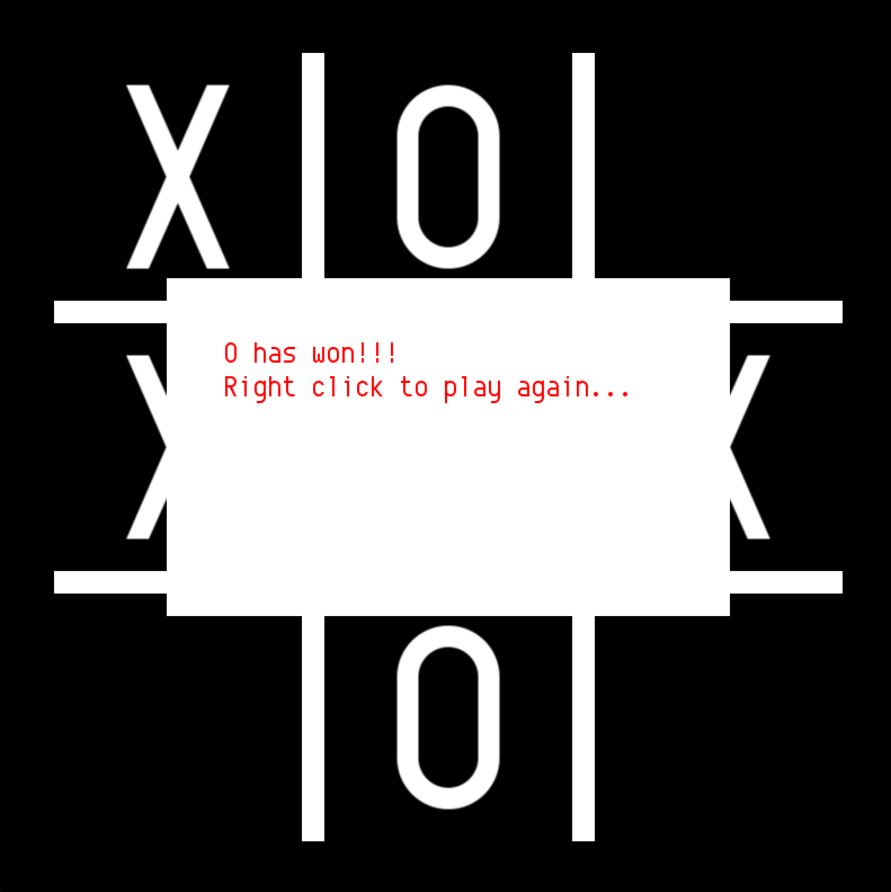

# Tic Tac Toe
For this project I wanted to do something simple so that the main focus was setting up my environment instead of the code, design, or logic.
I also wanted to set a precedent on how to organize future projects including proper documentation and comments, etc.
This is *getting my feet wet*. The code should be simple, quick, and clean with no if ands or buts. The docs should give an idea as to how I should write my future docs for larger projects.

The program is written in C++ and SFML.
[Docs.md](https://github.com/alyashour/Tic-Tac-Toe/blob/master/Docs.md) contains details on formatting, design, outcomes, and resources.

# Screenshots

